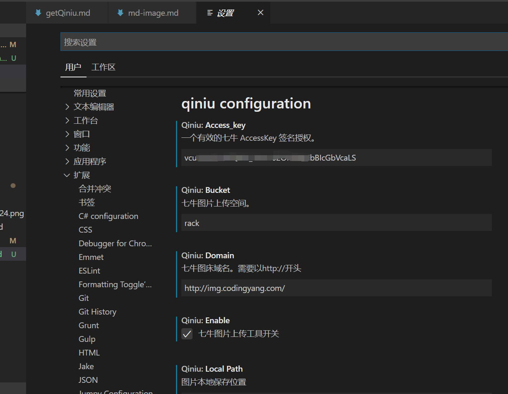
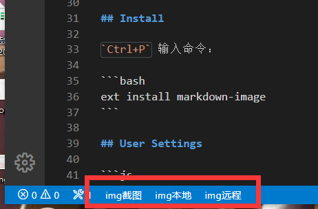
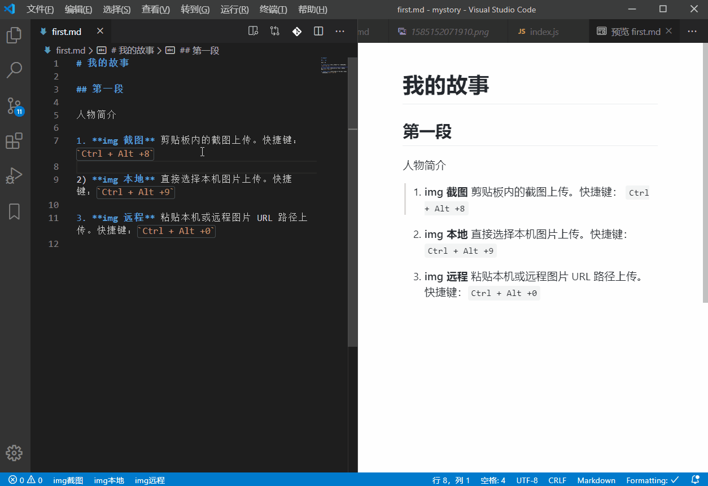
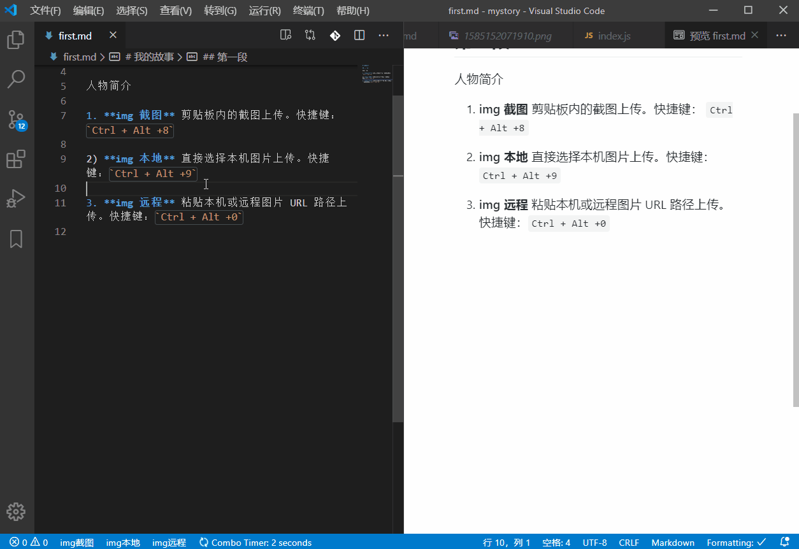
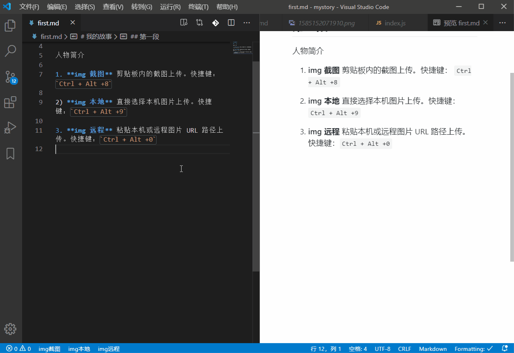

# markdown-image README

Import image to Markdown file by 3 ways. Select local file, input remote Url or local path, paste form clipbroad. It will be uploaded to Qiniu Cloud, and return image tag and url to your md file.

本插件可以用三种方式上传图片到七牛云存储，并将外链图片标签写回 md 文件。方式包括本地上传，本地/远程图片路径和截图粘贴。

还有一个设置图片在本机同目录下保存还是上传七牛云的开关。

[七牛云图床申请方法](https://www.codingyang.com/2020/03/getQiniu.html)

## 安装配置插件

VS Code 插件中搜索 `markdown-image` 就可以找到。点击 `Install` 安装。或者使用快捷键`Ctrl+P`，键入 `ext install markdown-image`


安装后首先配置七牛云参数，也就是上面第二篇文章中记录下来的`外链地址、AK、SK、存储名称`。

点击文件 → 首选项 → 设置（快捷键 `Ctrl + Shift +P` open user settings），在用户页找到扩展 → qiniu configuration。



这里填入各项配置：

```js
{
    // 插件开关，默认打开
    "qiniu.enable": true,

    // 你的七牛AK: AccessKey
    "qiniu.access_key": "*****************************************",

    // 你的七牛SK: SecretKey
    "qiniu.secret_key": "*****************************************",

    // 你的七牛存储名称
    "qiniu.bucket": "i-am-pic",

    // 你的七牛外链地址。注意需要以http://作为开头。
    "qiniu.domain": "http://xxxxx.xxxx.com",

    // 远程文件命名方式。参数化命名，暂时支持 ${fileName}、${mdFileName}、${date}、${dateTime}
    // 示例：
    //   ${mdFileName}-${dateTime} -> markdownName-20170412222810.jpg
    "qiniu.remotePath": "${fileName}",

    // 截图方式图片本地保存路径（因为七牛的api限制，截图上传是先将黏贴板里的图片存储到本地，然后再根据这个路径上传图片
    "qiniu.location": "./img"
}
```

修改以后会自动保存。设置完成后就可以开始使用了。

## 使用方法

打开 `.md` 文件后，左下角状态栏有 3 个按钮和一个开关。开关用于切换图片文件保存到本机路径还是上传七牛云。按钮功能如下：



1. **img 截图** 剪贴板内的截图上传。快捷键： `Ctrl + Alt +8`
   > 支持 qq，微信等工具的截图功能，会自动在本目录保存图片并上传云端。由于截图是保存在剪贴板，其他复制操作会覆盖截图。



2. **img 本地** 直接弹框选择本机图片上传。快捷键：`Ctrl + Alt +9`



3. **img 远程** 粘贴本地图片路径或远程图片 URL 上传。快捷键：`Ctrl + Alt +0`



上传成功后，插件会自动返回图片外链地址，并在光标处插入图片代码。如：

```md

```

云端文件命名会根据你设置的参数化命名方式。

## 注意事项

1. 只有在编辑 Markdown 文件时插件才可使用。
2. VS Code 在预览界面默认不加载 http 请求的图片，而七牛免费云图床使用 http 协议。要按照下图点击允许请求才能正常预览外链图片。


## 源代码库

本插件源码地址：

https://github.com/Rackar/md-image-code-ext

欢迎报告 Bug、建议以及 PR。

## 参考资料

本插件核心代码参考了下面 3 个库，修改为 qiniu 7.3.0 版 API 的用法，改为 TypeScript 版本。支持开源，尊重原创。

[https://github.com/favers/vscode-qiniu-upload-image](https://github.com/favers/vscode-qiniu-upload-image)

[https://github.com/yscoder/vscode-qiniu-upload-image](https://github.com/yscoder/vscode-qiniu-upload-image)

[https://github.com/gityangge/vscode-qiniu-upload-image-plus](https://github.com/gityangge/vscode-qiniu-upload-image-plus)

### Working with Markdown

**Note:** You can author your README using Visual Studio Code. Here are some useful editor keyboard shortcuts:

- Split the editor (`Cmd+\` on macOS or `Ctrl+\` on Windows and Linux)
- Toggle preview (`Shift+CMD+V` on macOS or `Shift+Ctrl+V` on Windows and Linux)
- Press `Ctrl+Space` (Windows, Linux) or `Cmd+Space` (macOS) to see a list of Markdown snippets

### For more information

- [Visual Studio Code's Markdown Support](http://code.visualstudio.com/docs/languages/markdown)
- [Markdown Syntax Reference](https://help.github.com/articles/markdown-basics/)

### Publish shell

本地打包
`vsce package`

发布到市场
`vsce publish minor` 或 `vsce publish patch`
