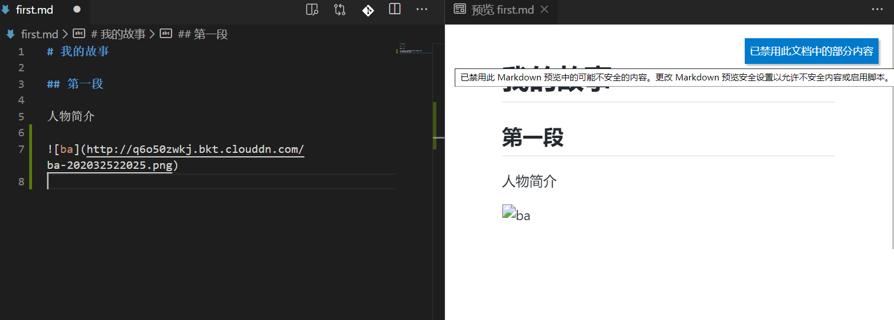
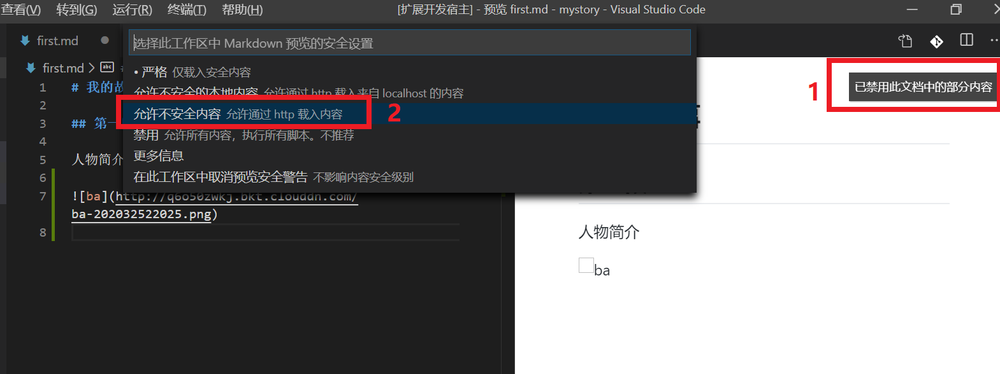

# markdown-image README

This is the README for VS Code extension "markdown-image". Import image tag to MD file by 3 ways.Select local file path, input Remote Url, paste form clipbroad. It will be uploaded to Qiniu Cloud, and insert img tag and url to your md file.

插件可以用三种方式上传图片到七牛云存储，并将外链图片标签写回 md 文件。方式包括本地上传，远程图片路径和截图粘贴。

## Features


> Tips: 只有在编辑 Markdown 时插件才可使用。

> Tips: 七牛云图床默认是 http 协议，在预览界面默认不加载 http 请求的图片。要按照下图允许请求才能正常预览。





## Usage

打开 `.md` 文件后，左下角状态栏有 3 个按钮：


1. **img 截图** 剪贴板内的截图上传。快捷键： `Ctrl + Alt +8`
2. **img 本地** 直接选择本机图片上传。快捷键：`Ctrl + Alt +9`
3. **img 远程** 粘贴远程图片 URL 路径上传。快捷键：`Ctrl + Alt +0`

> 支持 qq，微信等工具的截图功能，会自动在本目录保存图片并上传云端。

> 按键需在英文编辑状态下有效，功能 2 需要升级 vscode 到 v1.17+。

## Install

`Ctrl+P` 输入命令：

```bash
ext install markdown-image
```

## User Settings

```js
{
    // 插件开关。打开以后再MD文件编辑器中可用。
    "qiniu.enable": true,

    // 一个有效的七牛 AccessKey 签名授权
    "qiniu.access_key": "*****************************************",

    // 一个有效的七牛 SecretKey 签名授权
    "qiniu.secret_key": "*****************************************",

    // 七牛图片上传空间
    "qiniu.bucket": "ysblog",

    // 七牛图片上传路径，参数化命名，暂时支持 ${fileName}、${mdFileName}、${date}、${dateTime}
    // 示例：
    //   ${fileName}-${date} -> picName-20160725.jpg
    //   ${mdFileName}-${dateTime} -> markdownName-20170412222810.jpg
    "qiniu.remotePath": "${fileName}",

    // 七牛图床域名。注意需要以http://作为开头。
    "qiniu.domain": "http://xxxxx.xxxx.com",

    // 截图图片本地保存路径（因为七牛的api限制，截图上传是先将黏贴板里的图片存储到本地，然后再根据这个路径上传图片
    // 如果介意，可以再图片存储路径添加自动删除脚本
    "qiniu.location": "./img"
}
```

## 参考

本插件核心代码参考了下面 3 个库，修改为 qiniu 新版 API 的用法，改为 TypeScript 版本。支持开源，尊重原创。

[https://github.com/favers/vscode-qiniu-upload-image](https://github.com/favers/vscode-qiniu-upload-image)

[https://github.com/yscoder/vscode-qiniu-upload-image](https://github.com/yscoder/vscode-qiniu-upload-image)

[https://github.com/gityangge/vscode-qiniu-upload-image-plus](https://github.com/gityangge/vscode-qiniu-upload-image-plus)

## publish ext

本地打包
`vsce package`

发布到市场
`vsce publish minor` 或 `vsce publish patch`

## Working with Markdown

**Note:** You can author your README using Visual Studio Code. Here are some useful editor keyboard shortcuts:

- Split the editor (`Cmd+\` on macOS or `Ctrl+\` on Windows and Linux)
- Toggle preview (`Shift+CMD+V` on macOS or `Shift+Ctrl+V` on Windows and Linux)
- Press `Ctrl+Space` (Windows, Linux) or `Cmd+Space` (macOS) to see a list of Markdown snippets

### For more information

- [Visual Studio Code's Markdown Support](http://code.visualstudio.com/docs/languages/markdown)
- [Markdown Syntax Reference](https://help.github.com/articles/markdown-basics/)

**Enjoy!**
